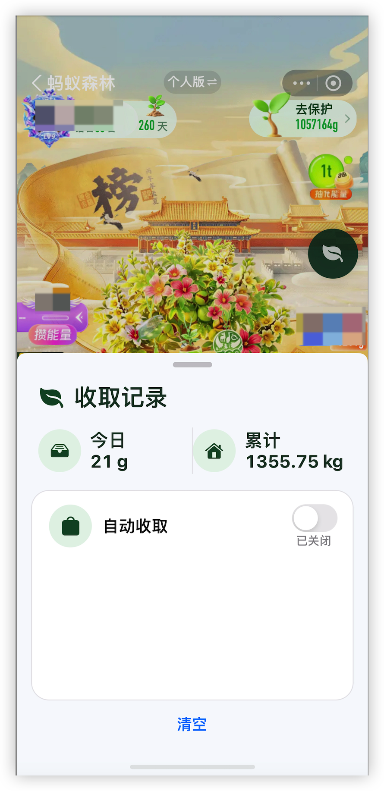

# AntForest TrollFools Port

基于IOS巨魔插件的支付宝蚂蚁森林自动收取插件，支持巨魔商店 TrollStore + 巨魔注入器 TrollFools 。它不依赖 MobileSubstrate、Theos 或 CaptainHook，使用 Objective-C Runtime Hook 构建为 `arm64e` dylib。

> 请自行评估账号、服务规则与设备安全风险。本项目不提供绕过风控或安全机制的功能。

## 效果图



功能包括：

- 右侧悬浮叶子按钮：默认位于右上方，可长按拖动；位置会保存在本机。
- 收取记录面板：叶子图标、今日/累计统计、统计分隔线及自动收取状态。
- 自动收取开关：开启后立即执行一次，之后每 300 秒运行；开关操作会写入“自动收集开始/关闭”日志。
- 日志倒序：最新记录显示在顶部；可清空本地日志。
- 能量统计：今日显示 g；累计满 1,000 g 后按两位小数换算为 kg。

## 使用说明

1. 使用巨魔注入器 TrollFools 注入 [`build/AntForestPort.dylib`](build/AntForestPort.dylib) 到支付宝。
2. 注入前移除旧的 `AntForestProbe.dylib`，避免两个 dylib 同时 Hook 同一方法。
3. 完全杀掉并重开支付宝，进入蚂蚁森林。
4. 点击右侧叶子按钮；需要调整位置时，长按并拖动叶子图标。
5. 在收取记录面板中打开“自动收取”开关。
6. 首次开启会立即执行一次，之后按 300 秒间隔运行。

设备控制台出现下列日志，表示注入入口已安装：

```text
[AntForestPort] installed: view=1 appearance=1 response=1
```

## 当前兼容范围

当前发布产物是 `arm64e`，最低构建目标为 iOS 16：

| 项目 | 当前状态 |
| --- | --- |
| CPU 架构 | `arm64e` |
| iOS | iOS 16 及以上 |
| 屏幕尺寸 | 使用 Auto Layout；标准版、Plus、Pro、Pro Max 均应自适应 |
| 非越狱 | 需要巨魔商店 TrollStore 与巨魔注入器 TrollFools 都支持目标系统 |
| 越狱 | 可手动注入 dylib；暂未提供 rootful/rootless `.deb` 包 |

“支持巨魔商店 TrollStore”并不等于必然兼容：巨魔注入器 TrollFools 的注入能力、支付宝版本、私有类和响应字段也必须匹配。

## 已验证环境

以下是**探针 dylib**的真机验证结果；正式移植版已在 macOS 上成功构建为 `arm64e`，仍需要在该设备上完成首次运行验证。

| 项目 | 结果 |
| --- | --- |
| 设备 | iPhone 14 Pro（A16，`arm64e`） |
| 系统 | iOS 16.2 |
| 安装环境 | 非越狱：巨魔商店 TrollStore + 巨魔注入器 TrollFools |
| 支付宝 | 12.12.6 |
| 探针结果 | `H5WebViewController` 与 `PSDJsBridge` Hook 成功 |
| 森林首页 | 新版顶层 `bubbles`、`userBaseInfo` 已确认 |
| 好友气泡 | `id`、`userId`、`collectStatus`、`overTime` 等字段已确认 |
| 好友排行榜 | `friendRanking`、`myself`、`totalDatas` 已确认 |

## 构建

需要完整 Xcode：

```sh
DEVELOPER_DIR=/Applications/Xcode.app/Contents/Developer make
```

产物位于 `build/AntForestPort.dylib`。

## 反馈

其他机型、iOS 版本或支付宝版本如有问题，欢迎提交 [Issue](../../issues/new)。

### 获取 `[AntForestPort]` 设备控制台日志

1. 用数据线连接 iPhone，解锁设备并在 iPhone 上选择“信任此电脑”。
2. 在 Mac 打开“控制台”App，左侧选择该 iPhone，点击“开始流式传输”。
3. 在搜索框输入 `AntForestPort`。
4. 完全杀掉并重开支付宝，进入蚂蚁森林，并按需要点击右侧叶子按钮或开启自动收取。
5. 复制出现的 `[AntForestPort]` 行并附到 Issue。

也可在 Xcode 中打开 `Window → Devices and Simulators → 你的 iPhone → Open Console`，再搜索 `AntForestPort`。

正常注入时会看到：

```text
[AntForestPort] installed: view=1 appearance=1 response=1
```

请同时附上从启动支付宝到复现问题前后的相关行；不要提交账号、手机号、用户 ID 或能量球 ID 等敏感内容。

Issue 请附上：

- 设备型号与 CPU 架构
- iOS、支付宝、巨魔商店 TrollStore 与巨魔注入器 TrollFools 版本
- 注入方式
- `[AntForestPort]` 相关设备控制台日志
- 是否出现浮窗、是否闪退、是否能打开日志面板
