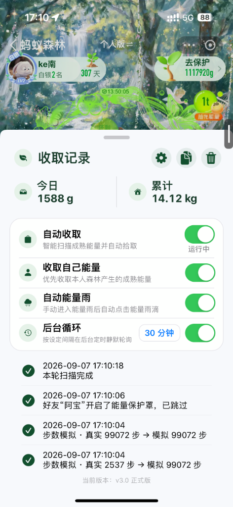

# AntForest TrollFools Port

基于iOS巨魔插件的支付宝蚂蚁森林能量自动收取插件，支持巨魔商店 TrollStore + 巨魔注入器 TrollFools 。它不依赖 MobileSubstrate、Theos 或 CaptainHook，使用 Objective-C Runtime Hook 构建为 `arm64 + arm64e` 通用 dylib。

## 来源与致谢

本项目基于 [qsirwyk/AntForestOneCollect](https://github.com/qsirwyk/AntForestOneCollect) 二次开发，保留原项目的 MIT 许可证与版权声明。感谢原作者 qsirwyk 的开源贡献。

> 请自行评估账号、服务规则与设备安全风险。本项目不提供绕过风控或安全机制的功能。

## 效果图



功能包括：

- 右侧悬浮叶子按钮：默认位于右上方，可长按拖动；位置会保存在本机。
- 收取记录面板：紧凑统计、三项功能卡片、独立的定时收取设置入口；标题右侧可“清空日志”。
- 自动收取总开关：控制好友与自己能量的自动收取；关闭后后台循环与定时收取都会暂停。
- 自动能量雨：可独立开关；开启后进入能量雨并点击“立即开启”，插件会自动点击屏幕内正在下降的能量。
- 循环收取（面板中显示为“后台循环”）：可独立开关；支持设置 1～60 分钟间隔，默认 5 分钟；当前以森林首页前台运行作为可靠使用条件。
- 每日定时收取：可设置多个每日固定时刻；到点仅执行一次好友/自己能量收取，不触发能量雨。已添加时间支持点选修改，并可向左滑动删除。
- 巨魔真后台：可配合 `ImmortalizerJailed.dylib` 尽量维持进程；退到桌面后不保证 H5/RPC 回包及实际收取。
- 日志倒序：最新记录显示在顶部；可清空本地日志。
- 能量统计：今日显示 g；累计满 1,000 g 后按两位小数换算为 kg；收取成功回包会去重计入统计。

> v2.4 已正式加入后台循环自定义间隔、每日定时收取、面板重构与收取统计修复。

## 当前稳定修复测试

本测试包用于验证首页收取修复，连续测试稳定后再发布正式版本：

- 蚂蚁森林首页前台自动收取已支持，无需手动点击“找能量”。
- 退到桌面后不保证收取；即使定时器仍在运行，支付宝 H5/WebView 的 RPC 回包也可能暂停。
- 回到蚂蚁森林首页时，Bridge 就绪后会立即尝试补跑一次收取。

## 使用说明

1. 使用巨魔注入器 TrollFools 注入 [`AntForestPort.dylib`](build/AntForestPort.dylib) 到支付宝。
2. 注入前移除旧的 `AntForestProbe.dylib`，避免两个 dylib 同时 Hook 同一方法。
3. 完全杀掉并重开支付宝，进入蚂蚁森林。
4. 点击右侧叶子按钮；需要调整位置时，长按并拖动叶子图标。
5. 在收取记录面板中按需打开“自动收取”和“自动能量雨”：两者相互独立；前者关闭后，后台循环与定时收取均暂停。
6. “后台循环”可单独开关，点击分钟按钮可设置 1～60 分钟间隔；在蚂蚁森林首页前台时，首次开启自动收取且后台循环已开启会立即执行一次。
7. 点击“定时收取设置”可添加多个每日固定时刻；点选已有时间可修改，向左滑动可删除。
8. 如需收取能量雨，进入能量雨页面并手动点击“立即开启”；开始后无需再手动点击雨滴。
   如出现没有自动收集能量雨滴，立即退出能量雨界面，保留能量雨次数，不妨碍下次使用。
   
设备控制台出现下列日志，表示注入入口已安装：

```text
[AntForestPort] installed: view=1 appearance=1 response=1
```

## 巨魔真后台（可选）

`AntForestPort` 自身不提供 iOS 后台保活。可配合
[ImmortalizerJailed](https://github.com/sergealagon/ImmortalizerJailed) 尽量减少支付宝进程被系统挂起或终止的情况，但不能保证支付宝 H5/WebView 在退到桌面后继续处理 RPC 回包。

### 为什么无法保证真后台运行？

iOS 不像 Android 一样允许用户为第三方工具授予“无障碍服务”权限，以读取其他 App 的界面节点、执行手势点击或提供跨 App 悬浮控制。对普通 App 而言，iOS 不开放跨 App 的界面层级读取、全局点击/手势注入和持续后台执行权限。

TrollStore 与 TrollFools 解决的是安装、签名绕过和向目标 App 注入 dylib 的问题，并不会自动获得这些系统级权限。因此，即使支付宝进程和插件定时器仍被保活，系统仍可能暂停离屏 H5/WebView 的网络回包与页面执行；这也是退到桌面后无法承诺稳定收取的根本原因。

后台使用步骤：

1. 使用 TrollFools 同时向支付宝注入 `AntForestPort-v2.4.dylib` 和 `ImmortalizerJailed.dylib`。
2. 完全杀掉并重新打开支付宝，进入蚂蚁森林首页。
3. 点击叶子按钮，在收取记录面板中开启“自动收取”。
4. 点击 ImmortalizerJailed 的浮动按钮启用保活。
5. 保持蚂蚁森林首页为当前页面；需要离开时可退到桌面，但不要从多任务界面划掉支付宝。

注意：

- 已观察到：退到桌面后，进程和循环定时器可能仍在运行，但 H5/RPC 回包可能暂停，因此不能承诺后台实际收取。
- 目前可靠行为是：保持蚂蚁森林首页在前台；从桌面回到森林首页后，插件会在 Bridge 就绪时立即尝试补跑一次。
- 后台循环默认间隔为 5 分钟，可调整为 1～60 分钟；首次开启开关时会立即执行一次。
- 能量雨依赖可见的 WebGL 页面和触摸事件，仍需在前台进入能量雨并点击“立即开启”。
- 真后台会持续占用 CPU、网络和电量，请根据需要启用。
- `ImmortalizerJailed` 使用 GPL-3.0 许可证，本项目不打包或再分发该 dylib，请从其官方仓库获取并单独注入。

## 当前兼容范围

当前发布产物为 `arm64 + arm64e` 通用 dylib，最低构建目标为 iOS 15：

| 项目 | 当前状态 |
| --- | --- |
| CPU 架构 | A11 及以下使用 `arm64`；A12 及以上使用 `arm64e` |
| iOS | iOS 15 及以上 |
| 屏幕尺寸 | 使用 Auto Layout；标准版、Plus、Pro、Pro Max 均应自适应 |
| 非越狱 | 需要巨魔商店 TrollStore 与巨魔注入器 TrollFools 都支持目标系统 |
| 越狱 | 可手动注入 dylib；暂未提供 rootful/rootless `.deb` 包 |

“支持巨魔商店 TrollStore”并不等于必然兼容：巨魔注入器 TrollFools 的注入能力、支付宝版本、私有类和响应字段也必须匹配。

典型设备：iPhone X、iPhone 8/8 Plus、iPhone 7 等为 `arm64`；iPhone XS/XR、iPhone 11 至 iPhone 16 系列为 `arm64e`。

## 已验证环境

以下是探针及正式移植版的真机验证结果：

| 项目 | 结果 |
| --- | --- |
| 设备 | iPhone 14 Pro（A16，`arm64e`） |
| 系统 | iOS 16.2 |
| 安装环境 | 非越狱：巨魔商店 TrollStore + 巨魔注入器 TrollFools |
| 支付宝 | 12.12.6、12.12.8 |
| 探针结果 | `H5WebViewController` 与 `PSDJsBridge` Hook 成功 |
| 森林首页 | 新版顶层 `bubbles`、`userBaseInfo` 已确认 |
| 好友气泡 | `id`、`userId`、`collectStatus`、`overTime` 等字段已确认 |
| 好友排行榜 | `friendRanking`、`myself`、`totalDatas` 已确认 |
| 自动能量雨 | 已确认能识别下降中的能量并自动收取 |
| 12.12.8 验证 | 森林收取、能量雨自动收取正常，无闪退或功能失效 |
| iOS 15.7 验证 | iPhone 13 Pro Max、支付宝 12.12.8；叶子面板可打开，自动收取的排行与好友状态查询正常 |
| iOS 15.0.1 验证 | iPhone X（A11，`arm64`）；通用 dylib 可通过 TrollFools 注入并正常使用 |
| 巨魔真后台 | iOS 16.2 下配合 ImmortalizerJailed：后台可维持周期定时器与请求发起，但 H5/RPC 回包及实际收取不保证；切回森林首页后可恢复补跑 |

## 构建

需要完整 Xcode：

```sh
DEVELOPER_DIR=/Applications/Xcode.app/Contents/Developer make
```

产物位于 `build/AntForestPort.dylib`。

GitHub Release 的通用 dylib 按 `AntForestPort-vX.Y.dylib` 命名。

## 反馈

- TG 讨论群：[iOS_AntFore](https://t.me/iOS_AntFore)，用于日常交流、使用讨论和问题收集。
- TG 频道：[AntFore](https://t.me/AntFore)，用于发布版本与项目动态。
- GitHub [Issues](../../issues) 用于提交可复现的问题、兼容性反馈和设备日志，便于持续跟踪处理。

### 获取 `[AntForestPort]` 设备控制台日志

1. 用数据线连接 iPhone，解锁设备并在 iPhone 上选择“信任此电脑”。
2. 在 Mac 打开“控制台”App，左侧选择该 iPhone，点击“开始流式传输”。
3. 在搜索框输入 `AntForestPort`。
4. 完全杀掉并重开支付宝，进入蚂蚁森林，并按需要点击右侧叶子按钮或开启自动收取。
5. 复制出现的 `[AntForestPort]` 行并附到 Issue。

也可在 Xcode 中打开 `Window → Devices and Simulators → 你的 iPhone → Open Console`，再搜索 `AntForestPort`。

正常注入时会看到：

```text
[AntForestPort] installed: view=1 appearance=1 response=1
```

请同时附上从启动支付宝到复现问题前后的相关行；不要提交账号、手机号、用户 ID 或能量球 ID 等敏感内容。

Issue 请附上：

- 设备型号与 CPU 架构
- iOS、支付宝、巨魔商店 TrollStore 与巨魔注入器 TrollFools 版本
- 注入方式
- `[AntForestPort]` 相关设备控制台日志
- 是否出现浮窗、是否闪退、是否能打开日志面板
